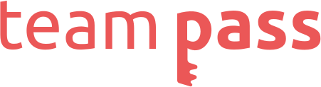

<p align="center">
    
</p>

# 🔐 FIDO-Login

<p align="center">
    <a href="/LICENSE" aria-label="License" target="_blank">
        </a>
    <a aria-label="Build Status" href="https://github.com/team-pass/FIDO-login/actions?query=workflow%3ABuild" target="_blank">
        </a>
    <a aria-label="Github contributors" href="https://github.com/team-pass/FIDO-login/graphs/contributors" target="_blank">
        </a>
</p>

A FIDO-compliant web app that has biometric authentication capabilities. Built using [Flask](https://flask.palletsprojects.com/en/1.1.x/), [Bootstrap](https://getbootstrap.com/), and the [Web Authentication API](https://developer.mozilla.org/en-US/docs/Web/API/Web_Authentication_API).

## 🗺 Project Layout

- [`fido_app/`](/fido_app): The Flask web app, which handles HTTP request processing and frontend-database interaction
- [`templates/`](/fido_app/templates): The HTML files for the login, registration, and profile pages
- [`static/`](/fido_app/static): Assets for our webpages, such as images, JS scripts, and CSS stylesheets
- [`run.py`](run.py): The driving code for the server (just call `python run.py`)

## 🚀 Quick Start

***Note:*** _It's recommended to install Python packages on a per-project basis within virtual environments. Flask provides a quick explanation of the motivation and process [here](https://flask.palletsprojects.com/en/1.1.x/installation/#virtual-environments)._

```bash
pip install -r requirements.txt # Downloads all required Python packages
python run.py                   # Runs the server in development mode
```

If you get errors about connecting to the database, make sure your environment variables are properly configured. You can check out our contribution guide for more detailed [setup instructions](CONTRIBUTING.md#-download-and-setup).


## 👨‍💻 Contribution Guide

If you want to add to this project, check out our [contribution guide](CONTRIBUTING.md)!

## ❓ FAQ

As the project progresses, we'll add more frequently asked questions to this section.

## 🔗 Useful Links

### Git
- [Git Introduction](https://guides.github.com/introduction/git-handbook/)

### Flask
- [Flask Documentation](https://flask.palletsprojects.com/en/1.1.x/)
- [Flask video tutorials by sentdex](https://pythonprogramming.net/practical-flask-introduction/)

### HTML/CSS/JS
- [Intro to HTML and CSS](http://learn.shayhowe.com/html-css/)
- [Bootstrap Documentation](https://getbootstrap.com/docs/4.4/getting-started/introduction/)
- [freecodecamp (web dev course)](http://www.freecodecamp.com/)
